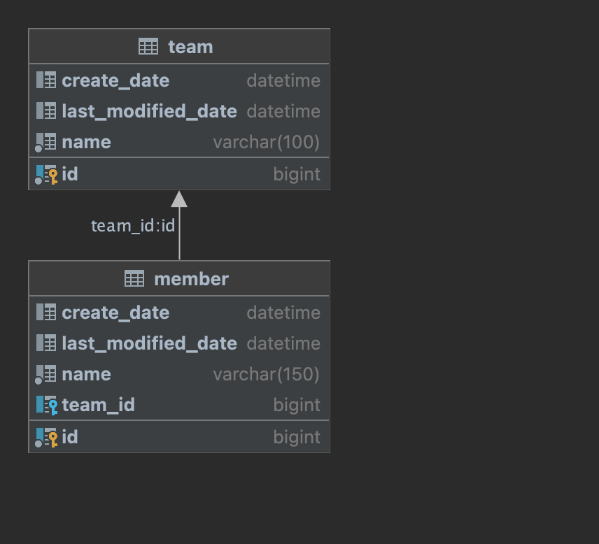

# GDSC-Server-JPA-Example

본 프로젝트는 JPA를 활용하여 Rest Api를 구성한 예제입니다.

## DB ERD

## 프로젝트 진행방식  

1. 기초적인 설정, JDBC를 통해 DB 연결(application.properties or application.yml)
2. 도메인, 즉 엔티티를 구성
3. 엔티티를 기반으로 하는 DAO인 레포지토리를 생성
4. Service 레이어에서 사용할 DTO 구성
5. Service 구성
6. Controller 구성
7. 테스트